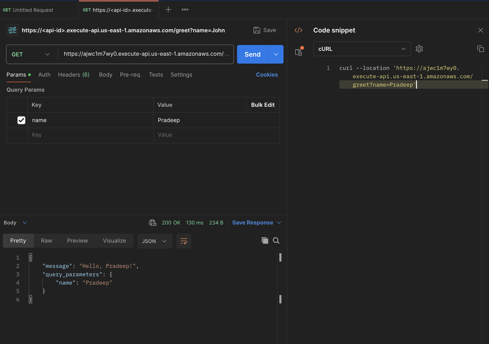

# bk-end-lambda-api

Prereqs:

Install Go
Insatll AWS CLI(https://docs.aws.amazon.com/cli/latest/userguide/getting-started-install.html)

Stack Used:

AWS CLI
go
AWS Lambda
AWS API Gateway

How to Run:

    Step 1:
    Configure AWS CLI (aws configure)
        Info Needed for configuration:

            AWS Access Key ID: Your access key.
            AWS Secret Access Key: Your secret access key.
            Default Region: The region for your AWS services (used us-east-1).
            Output Format: Choose json, text, or table (default: json).
    Step 2:
    Build an executable of the code from main
        GOOS=linux GOARCH=amd64 go build -o bootstrap main.go
        zip function.zip bootstrap
    
    Step 3:
    Create an AWS Lambda Function and ccollect the arn of the created function "FunctionArn"
       go-lambda % aws lambda create-function \
            --function-name go-lambda-api \
            --runtime provided.al2 \ 
            --role arn:aws:iam::********:role/lambda-admin \
            --handler main \
            --zip-file fileb://function.zip \
            --region us-east-1

    Step 4:
    Create an API Gateway 
        aws apigatewayv2 create-api \
            --name "GoLambdaAPI" \
            --protocol-type HTTP \
            --target arn:aws:lambda:us-east-1:********:function:go-lambda-api

    Step 5:
    Test using Postman
    endpoint will be created by API Gateway addd the parameter name and your value

    curl --location 'https://ajwc1m7wy0.execute-api.us-east-1.amazonaws.com/greet?name=Pradeep'

    

